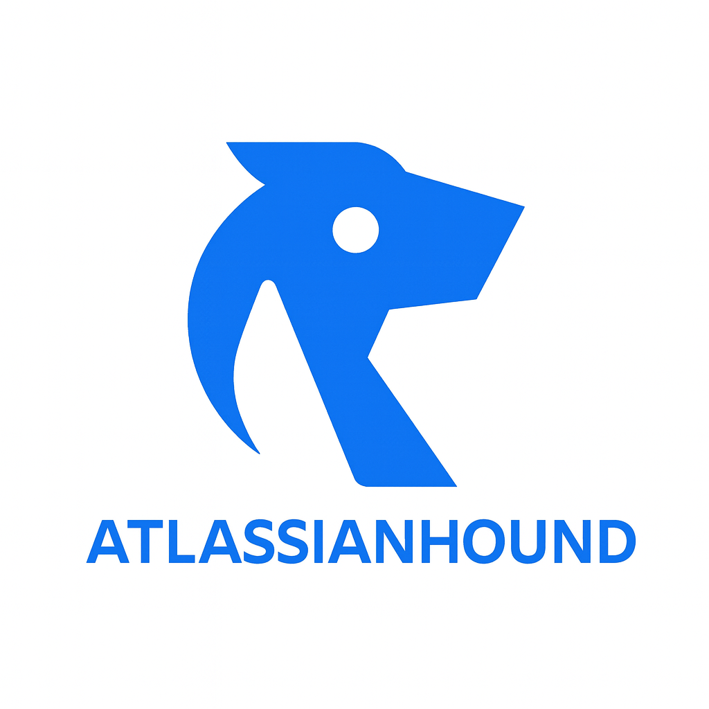

<div align="center">
  

  # AtlassianHound

  
  
  

  **BloodHound-ready Atlassian Cloud collector.**

  AtlassianHound bridges Atlassian Cloud's API with BloodHound's attack graph model to visualize identity and privilege relationships across Jira, Confluence, and Atlassian Teams.
</div>

---

## Highlights

- **15 Collectors** – Users, groups, teams, spaces, projects, roles, permissions, apps, webhooks, security schemes, and more
- **Native BloodHound Format** – Exports OpenGraph JSON with proper node types, edge labels, and relationship metadata
- **55+ Pre-Built Queries** – Risk analysis, attack paths, privilege escalation, third-party app detection, and investigation queries
- **Rich Tooltips** – All nodes and edges include descriptions for better BloodHound UI experience
- **Risk Scoring** – Automatic high-value tagging and risk scoring for admin groups
- **Third-Party App Detection** – Track installed apps and potential persistence/exfiltration vectors

>  **Important**: Many Jira APIs require **Jira Administrator** permissions. Non-admin API tokens will collect Confluence data successfully but miss critical Jira project permissions. See [Permissions](#-permissions-requirements) below.

---

## Quick Start

```bash
# 1. Clone and install
git clone https://github.com/gboudreau-devo/AtlassianHound.git
cd AtlassianHound
pip install -r requirements.txt

# 2. Test authentication
python atlassian_hound.py --test-auth

# 3. Run collection
python atlassian_hound.py --output output/ --parallel

# 4. Upload to BloodHound
python houndpaint.py -s http://localhost:8080 --api-id YOUR_BLOODHOUND_TOKEN_ID --api-key YOUR_BLOODHOUND_TOKEN_KEY --auto-upload output/open_graph.json --register --post-ingest-fixups
```

---

## Usage

### Basic Collection

```bash
# Collect all data (default)
python atlassian_hound.py --output output/

# Collect specific modules
python atlassian_hound.py --collect users,groups,spaces,projects

# Exclude specific modules
python atlassian_hound.py --exclude webhooks,apps

# Run with parallel collection (faster)
python atlassian_hound.py --parallel --max-workers 5
```

### Available Collectors

- `users` - Atlassian users and account details
- `groups` - Jira/Confluence groups and memberships
- `teams` - Atlassian Teams
- `spaces` - Confluence spaces and permissions
- `projects` - Jira projects
- `permissions` - Project-level permissions and roles
- `confluence_restrictions` - Page/space restrictions
- `global_permissions` - Jira/Confluence global permissions
- `org_admin` - Organization administrator roles
- `application_roles` - Jira application roles
- `jsm` - Jira Service Management queues
- `apps` - Third-party apps/plugins
- `webhooks` - Webhook configurations
- `security_schemes` - Jira security schemes
- `watchers` - Issue watchers (optional)

### BloodHound Registration

```bash
# Register node types and queries in BloodHound
python houndpaint.py \
  -s http://localhost:8080 \
  --api-id YOUR_TOKEN_ID \
  --api-key YOUR_TOKEN_KEY \
  --model model.json \
  --register

# Upload data with automatic node type registration
python houndpaint.py \
  -s http://localhost:8080 \
  --api-id YOUR_TOKEN_ID \
  --api-key YOUR_TOKEN_KEY \
  --auto-upload output/open_graph.json \
  --register \
  --post-ingest-fixups

# Reset all custom node types and re-register
python houndpaint.py \
  -s http://localhost:8080 \
  --api-id YOUR_TOKEN_ID \
  --api-key YOUR_TOKEN_KEY \
  --model model.json \
  --reset \
  --register
```

---

## Permissions Requirements

AtlassianHound requires different permission levels depending on what data you want to collect:

### Minimum Permissions (Confluence Only)
- **Confluence User** with API token
- Collects: Users, groups, Confluence spaces, space permissions, teams

### Recommended Permissions (Full Coverage)
- **Jira Administrator** + **Confluence Administrator** with API token
- Collects: Everything above PLUS Jira project roles, permission schemes, application roles, webhooks, security schemes
- Provides: Complete attack graph with both Jira and Confluence privileges

### Organization Admin (Optional)
- **Organization Administrator** role
- Collects: Organization-level admin role assignments
- Not required for most privilege analysis

### What Happens Without Admin Permissions?

If you run AtlassianHound with a non-admin API token:

- **Confluence permissions work 100%** - Full space admins, restrictions, group memberships
- **Jira permissions missing** - No project role data, no permission schemes
- **Queries return partial results** - Confluence-focused queries work, Jira queries return nothing

**Example:**
```
With Non-Admin API:
  Users: 443 ✅
  Groups: 102 ✅
  Confluence Spaces: 159 ✅
  Group → Space permissions: 641 ✅
  Jira Projects: 77 ✅
  Group → Project permissions: 0 ❌ (MISSING)
```

To get full coverage, create an API token from a user with **Jira Administrator** permissions.

---

## Pre-Built Queries

AtlassianHound includes **55+ ready-to-use queries** organized into categories:

### Risk Analysis (10 queries)
- High-Value Users/Groups - Find privileged accounts
- Over-Privileged Users - Users with 10+ space access
- External User Access - Non-internal domains with privileges
- Inactive Users with Privileges - Stale accounts
- Single Points of Failure - Critical resources with 1 admin

### Attack Paths (12 queries)
- Shadow Admins via Group Membership - Hidden privilege escalation
- Confluence/Jira Takeover Paths - User → Group → AdminTo chains
- Third-Party App Abuse - Enabled apps on instances
- Webhook Managers - Persistence opportunities
- Cross-Product Privilege Escalation - Confluence → Jira paths

### Investigation (13 queries)
- Find User/Group by Name - Search principals
- User's Full Attack Surface - All direct + inherited privileges
- Who Can Admin This Space/Project - Resource permission audit
- Shortest Path Between Users - Relationship analysis
- All Paths from User to Resource - Custom attack path search

### Third-Party Apps (6 queries)
- All/Enabled Third-Party Apps - Installed plugins
- User-Installed Apps - Non-default apps
- Apps by Vendor - Filter by vendor name
- Jira/Confluence Apps - Product-specific apps

### Offensive Security (10 queries)
- External Webhook Exfiltration Channels - Data exfiltration risks
- Service Desk Projects - Sensitive customer data access
- Global Admin Privilege Escalation - Instance-level admins
- Restricted Confluence Pages - Sensitive document access

All queries are pre-loaded into BloodHound after running `houndpaint.py --register`. Access them via the **Saved Queries** panel in BloodHound UI.

---

## 📊 Data Model

### Node Types

- **CFUser** - Atlassian Cloud users
- **CFGroup** - Jira/Confluence groups
- **CFTeam** - Atlassian Teams
- **CFSpace** - Confluence spaces
- **CFPage** - Confluence pages
- **JProject** - Jira projects
- **JIssue** - Jira issues
- **JRole** - Jira project roles
- **JApplicationRole** - Jira application roles
- **JServiceDesk** - JSM service desks
- **ThirdPartyApp** - Installed apps/plugins
- **Webhook** - Webhook configurations
- **JSecurityScheme** - Jira security schemes
- **AtlassianInstance** - Organization root node

### Relationship Types (16 edges)

**Membership Edges:**
- **MemberOf** - User → Group membership
- **CFMemberOfGroup** / **CFGroupHasMember** - Confluence group membership
- **CFMemberOfTeam** / **CFTeamHasMember** - Atlassian Team membership

**Privilege Edges:**
- **AdminTo** - Administrative privileges (space/project admin)
- **GenericWrite** - Write/edit permissions
- **CFHasPermission** - Confluence permissions with permission array
- **JRoleInProject** - Jira project role assignment

**Structure Edges:**
- **Contains** - Containment relationships
- **PageInSpace** - Page → Space relationships
- **InstalledOn** - Third-party app installations

**Restriction Edges:**
- **CFPageRestriction** - Page view/edit restrictions

All edges include descriptions visible as tooltips in BloodHound UI.

### High-Value Detection

AtlassianHound automatically tags high-value targets:

- Groups with "admin" in the name
- Groups with 50+ direct privilege edges
- Groups with "security", "executive", "org-admin" keywords
- Risk scores: LOW, MEDIUM, HIGH, CRITICAL

---

## Requirements

- Python 3.10+
- BloodHound CE v8.2+
- Atlassian Cloud instance
- API token with appropriate permissions

```bash
pip install -r requirements.txt
```

---


## License

MIT License - see LICENSE file for details

---

## Disclaimer

This tool is for authorized security testing and defensive security operations only. Ensure you have proper authorization before running against any Atlassian instance. The authors are not responsible for misuse or damage caused by this tool.

---


## Additional Resources

- [BloodHound Documentation](https://bloodhound.specterops.io/home)
- [Atlassian Cloud API Documentation](https://developer.atlassian.com/cloud/)
- [OpenGraph Format Specification](https://github.com/SpecterOps/BloodHound/blob/main/packages/go/dawgs/docs/OpenGraph.md)

---

**Built with ☕ for the security community**
